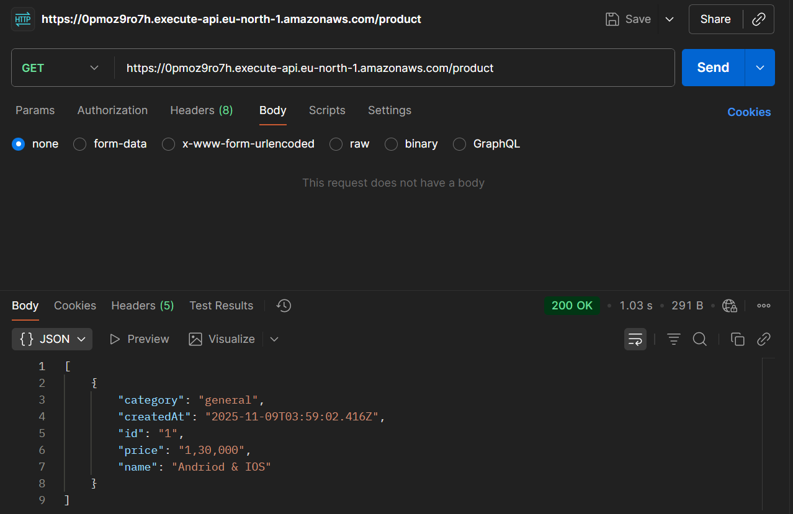
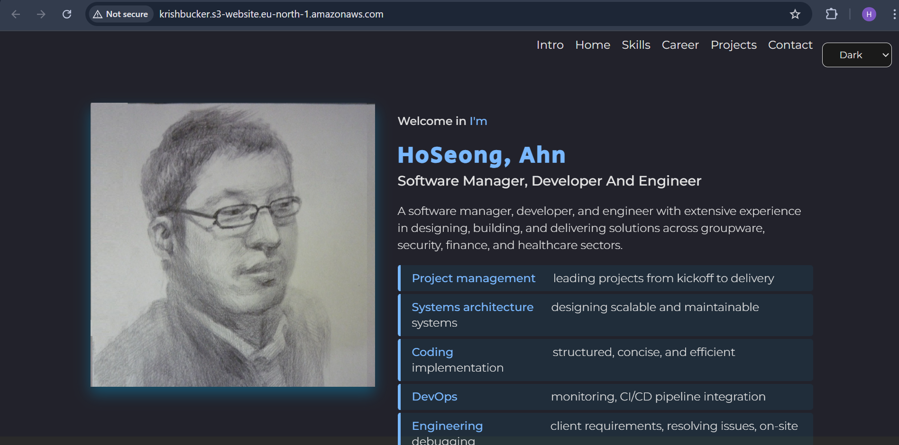
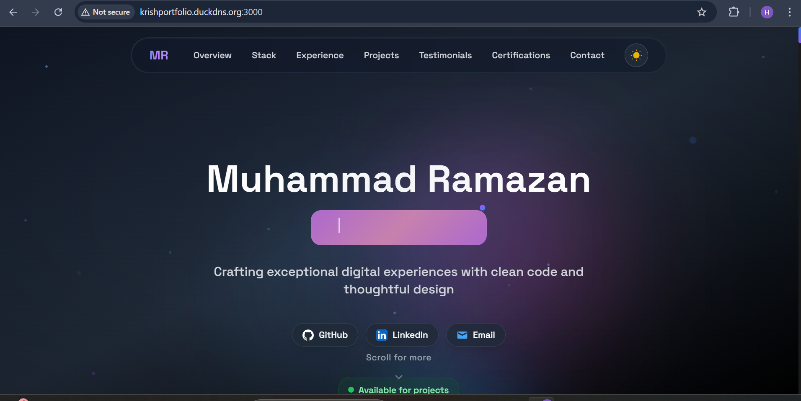
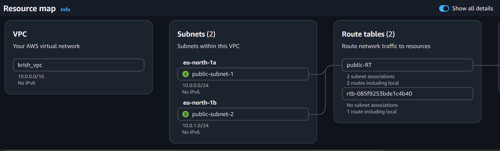
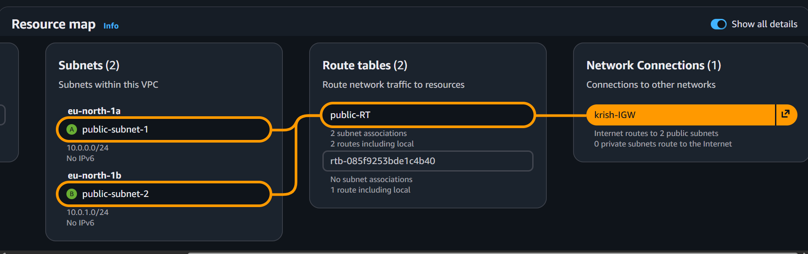

# 🚀 AWS Cloud Engineer Portfolio

Hi, I'm **Hari krishna** — an AWS Cloud Engineer with 2+ years of Flutter development experience.  
I design **serverless architectures**, automate workflows using **IAC (CloudFormation)**, and build end-to-end solutions using **Lambda, API Gateway, DynamoDB, EC2, S3, CloudFront (CDN), and CloudWatch**.

---

## 🧩 Projects

### 1️⃣ Serverless CRUD API (Lambda + API Gateway + DynamoDB)
**Description:**  
Built a fully serverless REST API using AWS Lambda, API Gateway, and DynamoDB.  
Used CloudWatch for monitoring and tested via Postman.

**Features:**
- `POST /product` → Add Product  
- `GET /product/{id}` → Get Products  
- `DELETE /users/{id}` → Delete user  
- Infrastructure deployed using **CloudFormation (YAML IAC)**  

**Screenshots:**  

**Tech Stack:**  
AWS Lambda | DynamoDB | API Gateway | CloudFormation | CloudWatch | Node.js

**Demo:**  
🔗 **API Endpoint:** [https://0pmoz9ro7h.execute-api.eu-north-1.amazonaws.com/product](https://0pmoz9ro7h.execute-api.eu-north-1.amazonaws.com/product)

---

### 2️⃣ Static Website Hosting (S3 + CloudFront)
**Description:**  
Hosted a responsive portfolio website on S3 with CloudFront for CDN and Route53 for domain routing.

**Screenshots:**  

**Tech Stack:**  
S3 | CloudFront | Route53 | HTML | CSS | React
**Demo:**  
🔗 **S3 Website:** [http://krishbucker.s3-website.eu-north-1.amazonaws.com/](http://krishbucker.s3-website.eu-north-1.amazonaws.com/)

---

### 3️⃣ EC2 Deployment with Elastic IP + DuckDNS (Next.js Project)
**Description:**  
Deployed a **Next.js portfolio website** on an **EC2 instance**, configured an **Elastic IP** for static addressing, and linked a **custom DuckDNS domain** for public access.  
Implemented security group rules for HTTP/HTTPS and SSH access.

**Code:**
[View CloudFormation Template](iac/serverless.yaml)

**Features:**

**Screenshots:**  

**Tech Stack:**  
EC2 | Elastic IP | DuckDNS | Next.js | Nginx | Linux (Ubuntu)

**Demo:**  
🔗 [http://krishportfolio.duckdns.org:3000](http://krishportfolio.duckdns.org:3000)

---

#### 4️⃣ Core Networking & Scaling (VPC, Subnets, Route Table, IGW, ALB, ASG, Target Groups)
Provisioned secure and scalable AWS infrastructure using CloudFormation, including:
- **VPC**: Custom Virtual Private Cloud for network isolation
- **Subnets**: Public and private subnets for tiered architecture
- **Route Table**: Configured routing for public/private access
- **Internet Gateway (IGW)**: Enabled internet access for public subnet resources
- **Application Load Balancer (ALB)**: Distributed traffic across EC2 instances
- **Auto Scaling Group (ASG)**: Automated EC2 scaling based on demand
- **Target Groups**: Managed EC2 instance health and traffic routing

**Features:**
- Highly available and secure network setup
- Automated scaling and load balancing for web applications
- Tagging for resource management and cost allocation
- Infrastructure as Code (CloudFormation YAML)

**Tech Stack:**
VPC | Subnets | Route Table | IGW | EC2 | ALB | ASG | Target Groups | CloudFormation

**Screenshots:**  

### 5️⃣ Infrastructure as Code (DynamoDB Setup)
**Description:**  
Created DynamoDB tables (`Product`) using CloudFormation YAML template.

**Code:**  
[View CloudFormation Template](iac/serverless.yaml)

---

## 🧰 Tools & Skills
- **AWS Services:** EC2, Elastic IP, S3, CloudFront, Route53, Lambda, API Gateway, DynamoDB, CloudWatch, CloudFormation  
- **Languages:** JavaScript, YAML, JSON  
- **Dev Tools:** VS Code, Postman, Git, AWS Console  

---

## 🌐 Portfolio
🔗 **Live Portfolio Site:** [https://harikrish-portfolio25.web.app/](https://harikrish-portfolio25.web.app/)

---

## 📬 Contact
**LinkedIn:** [linkedin.com/in/hari-krish-13300b27a](https://www.linkedin.com/in/hari-krish-13300b27a/)  

**Email:** [harikrish58027@gmail.com](mailto:harikrish58027@gmail.com) | [Gmail Link](https://mail.google.com/mail/?view=cm&to=harikrish58027@gmail.com)

